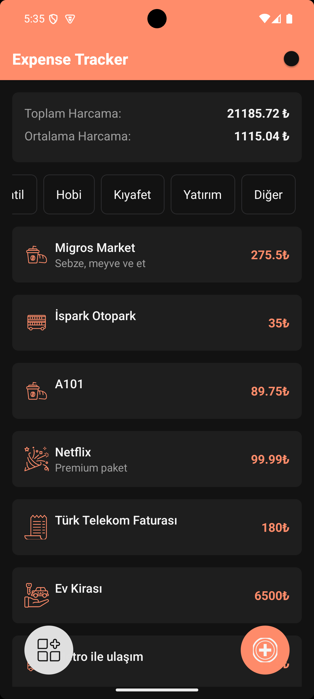
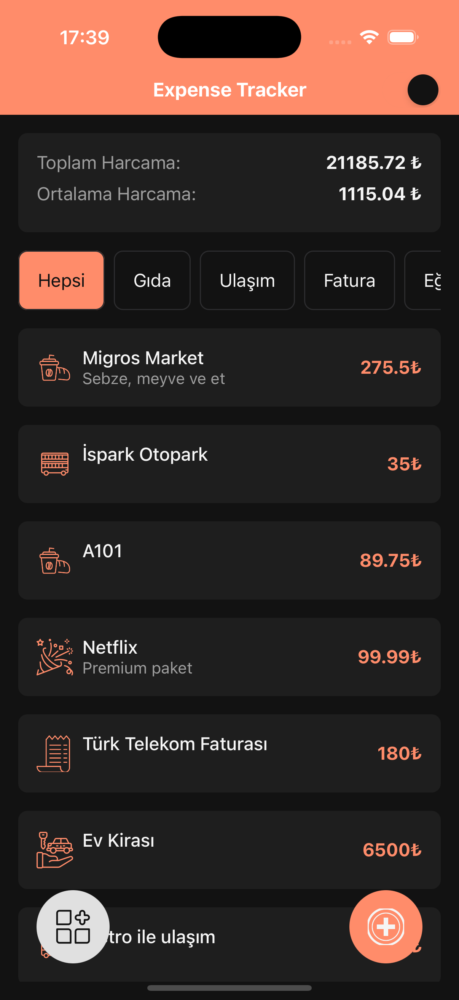
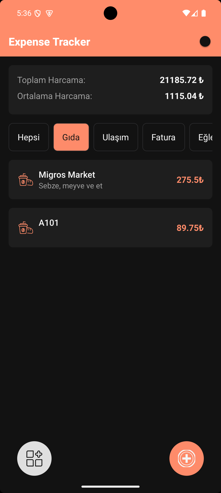
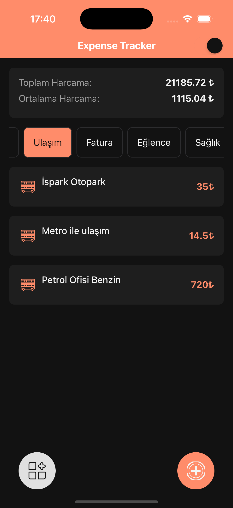
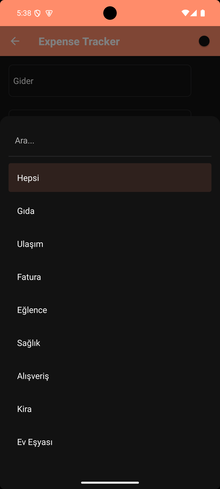
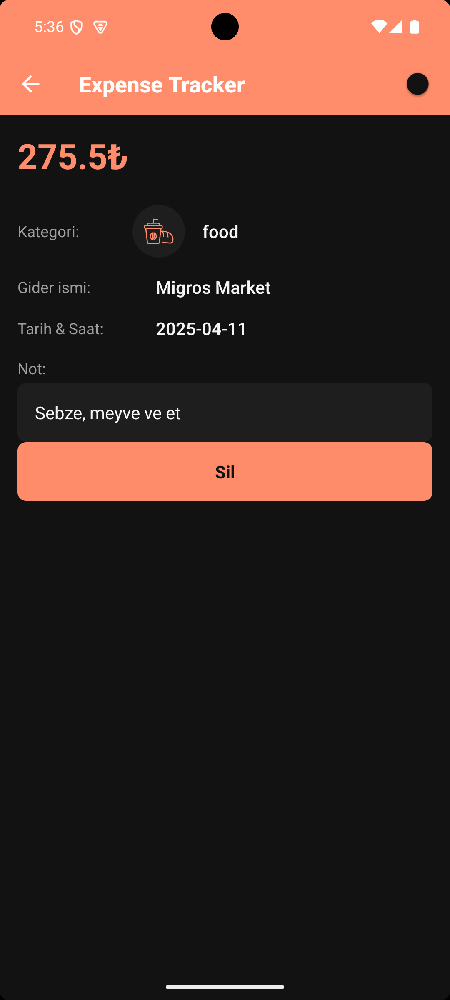
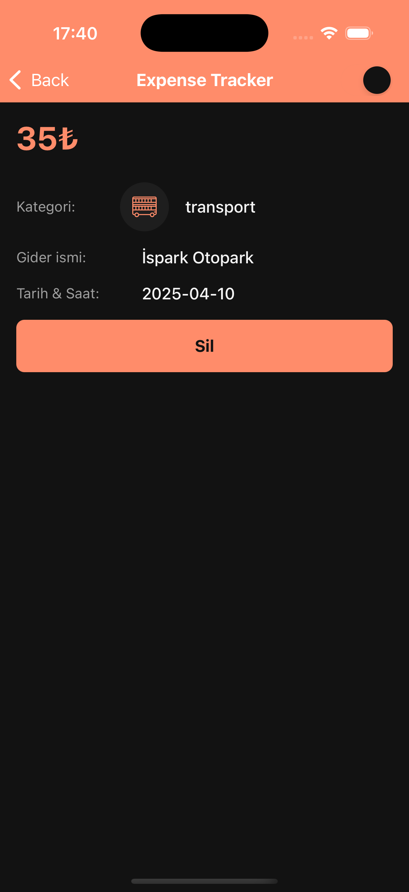

# 💸 Expense Tracker App – Harcama Takip Uygulaması

Kişisel harcamalarını kolayca takip edebileceğin sade ve kullanışlı bir mobil uygulamadır. Yeni gider ekle, kategorilere ayır, filtrele ve geçmiş harcamalarını görüntüle.

A simple and easy-to-use mobile app to track your personal expenses. Add new expenses, categorize them, filter by category, and view past transactions.

---

## 📱 Uygulama Görselleri (Screenshots)

### ☀️ Açık Tema (Light Theme)

<table>
  <tr>
    <td align="center">
      <strong>Ana Ekran (Android)<br/>Home Screen (Android)</strong><br/>
      
    </td>
    <td align="center">
      <strong>Ana Ekran (iOS)<br/>Home Screen (iOS)</strong><br/>
      
    </td>
  </tr>
  <tr>
    <td align="center">
      <strong>Filtreli Görünüm (Android)<br/>Filtered View (Android)</strong><br/>
      
    </td>
    <td align="center">
      <strong>Filtreli Görünüm (iOS)<br/>Filtered View (iOS)</strong><br/>
      
    </td>
  </tr>
  <tr>
    <td align="center">
      <strong>Gider Ekle (Android)<br/>Add Expense (Android)</strong><br/>
      
    </td>
    <td align="center">
      <strong>Gider Ekle (iOS)<br/>Add Expense (iOS)</strong><br/>
      
    </td>
  </tr>
  <tr>
    <td align="center">
      <strong>Detay (Android)<br/>Expense Detail (Android)</strong><br/>
      
    </td>
    <td align="center">
      <strong>Detay (iOS)<br/>Expense Detail (iOS)</strong><br/>
      
    </td>
  </tr>
</table>

---

### 🌙 Karanlık Tema (Dark Theme)

<table>
  <tr>
    <td align="center">
      <strong>Ana Ekran (Android)<br/>Home Screen (Android)</strong><br/>
      
    </td>
    <td align="center">
      <strong>Ana Ekran (iOS)<br/>Home Screen (iOS)</strong><br/>
      
    </td>
  </tr>
  <tr>
    <td align="center">
      <strong>Filtreli Görünüm (Android)<br/>Filtered View (Android)</strong><br/>
      
    </td>
    <td align="center">
      <strong>Filtreli Görünüm (iOS)<br/>Filtered View (iOS)</strong><br/>
      
    </td>
  </tr>
  <tr>
    <td align="center">
      <strong>Gider Ekle (Android)<br/>Add Expense (Android)</strong><br/>
      
    </td>
    <td align="center">
      <strong>Gider Ekle (iOS)<br/>Add Expense (iOS)</strong><br/>
      
    </td>
  </tr>
  <tr>
    <td align="center">
      <strong>Detay (Android)<br/>Expense Detail (Android)</strong><br/>
      
    </td>
    <td align="center">
      <strong>Detay (iOS)<br/>Expense Detail (iOS)</strong><br/>
      
    </td>
  </tr>
</table>

---

## 🚀 Özellikler / Features

- 📂 Harcamaları kategoriye göre filtreleme  
  Filter expenses by category

- ➕ Yeni harcama ekleme (isim, tutar, tarih, not, kategori)  
  Add new expense with title, amount, date, note, and category

- 📊 İstatistik görünümü (gider sayısı, toplam tutar)  
  View expense statistics (count & total amount)

- 🗃 Kategori oluşturma ve seçim  
  Create and select custom categories

- 🧾 Detay ekranında gider bilgisi görüntüleme ve silme  
  View and delete expenses from detail screen

---

## ⚙️ Kurulum / Installation

1. Repoyu klonla  
   Clone the repository:

   ```bash
   git clone https://github.com/kaancaman/ExpenseTracker-RN.git
   cd ExpenseTracker-RN
   ```

2. Bağımlılıkları yükle
   Install dependencies:

   ```bash
   npm install
   # or / veya
   yarn
   ```

3. Uygulamayı başlat
   Start the app:

   ```bash
   npx react-native start
   npx react-native run-ios
   npx react-native run-android
   ```

> iOS ve Android için React Native CLI kullanılır.
> React Native CLI is used for both iOS and Android.

---

## 📁 Proje Yapısı / Project Structure

```bash
.
├── assets/              # Icon, logo, screenshot assets
├── components/          # Buttons, inputs, reusable UI components
├── data/mock/           # Mock data for expenses and categories
├── icon/                # Category icons (SVG)
├── navigation/          # Navigation stack
├── screen/              # Screens: Home, AddExpense, Category, Detail
├── theme/               # Theme settings (colors, spacing, fonts)
└── utils/               # UI texts, utility functions
```

---

## 🧪 Geliştirici Notları / Developer Notes

- Veriler mock olarak tutulur, veritabanı entegrasyonu yapılmamıştır.

  All data is mocked; there is no database integration.

- Kategori, harcama ve istatistik yönetimi tamamen lokal state üzerinden yapılır.

  Category, expense, and stats management is handled via local state.

- UI yapısı tema desteklidir (light & dark mode uyumlu).

  The UI is theme-enabled and supports both light and dark modes via Context API.

---

Made with ❤️ by [KAAN CAMAN](https://github.com/KaanCaman)
