# 💸 Expense Tracker App – Harcama Takip Uygulaması

Kişisel harcamalarını kolayca takip edebileceğin sade ve kullanışlı bir mobil uygulamadır. Yeni gider ekle, kategorilere ayır, filtrele ve geçmiş harcamalarını görüntüle.

---

## 📱 Uygulama Görselleri

<table>
  <tr>
    <td align="center">
      <strong>Ana Ekran (Android)</strong><br/>
      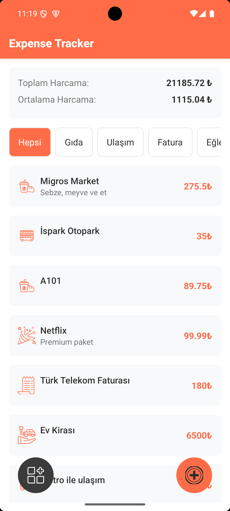
    </td>
    <td align="center">
      <strong>Ana Ekran (iOS)</strong><br/>
      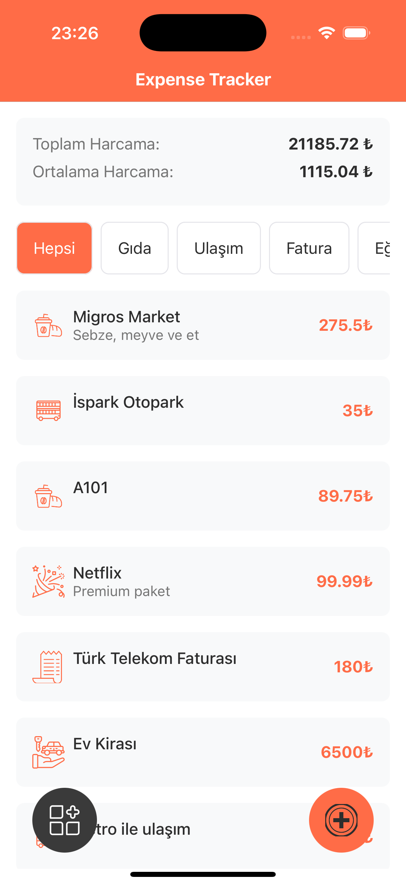
    </td>
  </tr>
  <tr>
    <td align="center">
      <strong>Filtrelenmiş Harcamalar (Android)</strong><br/>
      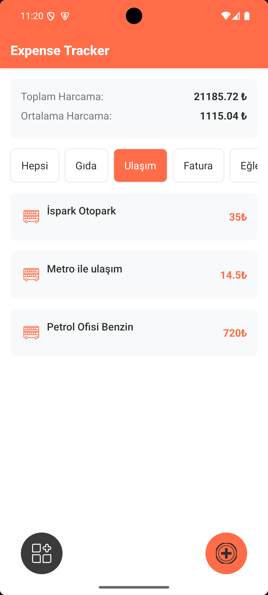
    </td>
    <td align="center">
      <strong>Filtrelenmiş Harcamalar (iOS)</strong><br/>
      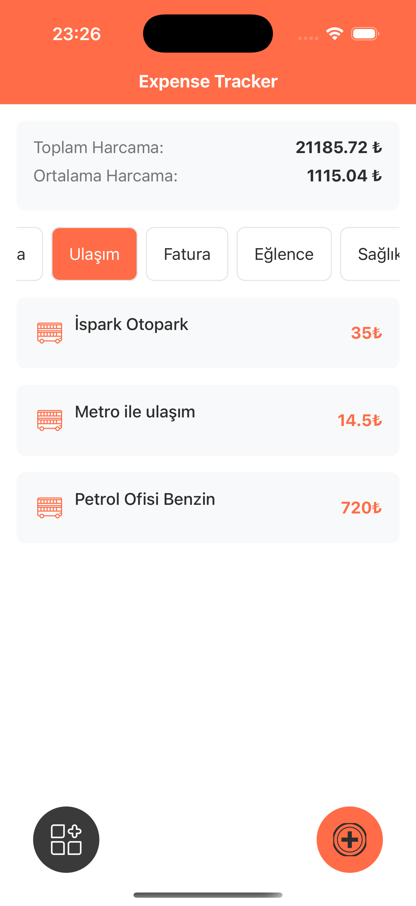
    </td>
  </tr>
  <tr>
    <td align="center">
      <strong>Gider Ekleme (Tarih - Android)</strong><br/>
      
    </td>
    <td align="center">
      <strong>Gider Ekleme (Tarih - iOS)</strong><br/>
      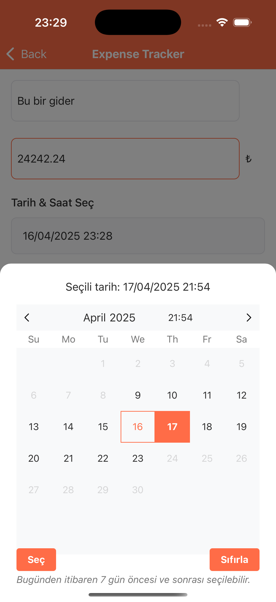
    </td>
  </tr>
  <tr>
    <td align="center">
      <strong>Gider Ekleme (Picker - Android)</strong><br/>
      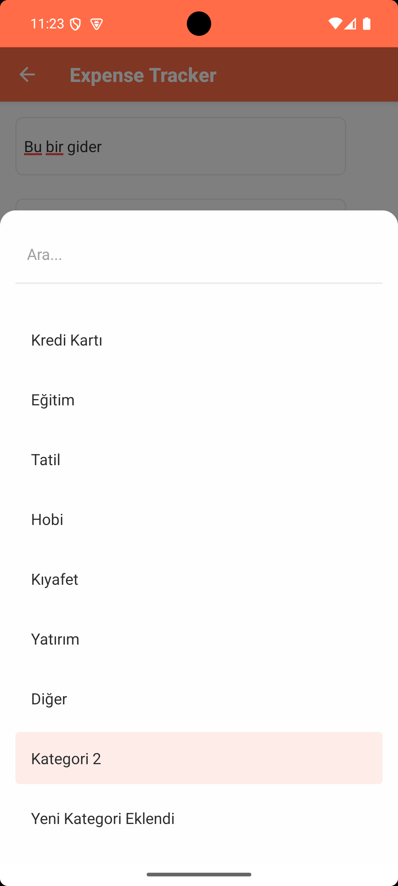
    </td>
    <td align="center">
      <strong>Gider Ekleme (Picker - iOS)</strong><br/>
      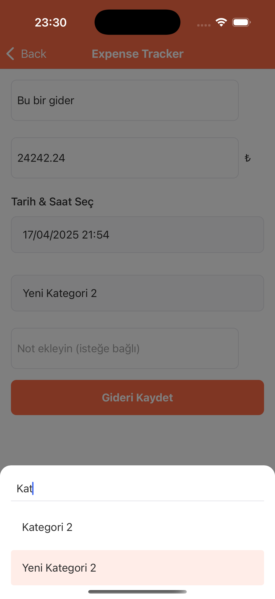
    </td>
  </tr>
  <tr>
    <td align="center">
      <strong>Gider Ekleme (Dolu - Android)</strong><br/>
      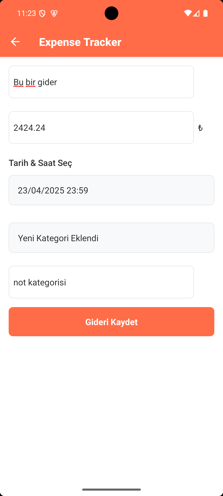
    </td>
    <td align="center">
      <strong>Gider Detay (iOS)</strong><br/>
      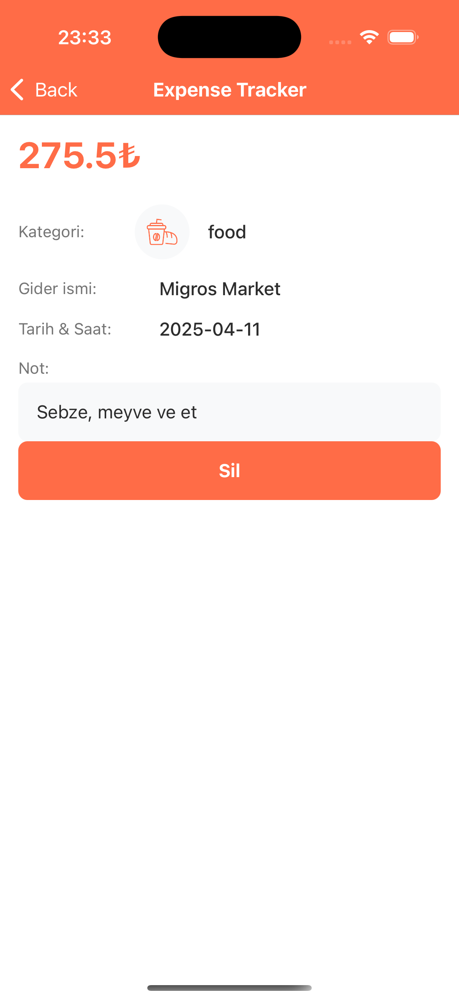
    </td>
  </tr>
  <tr>
    <td align="center">
      <strong>Gider Detay (Android)</strong><br/>
      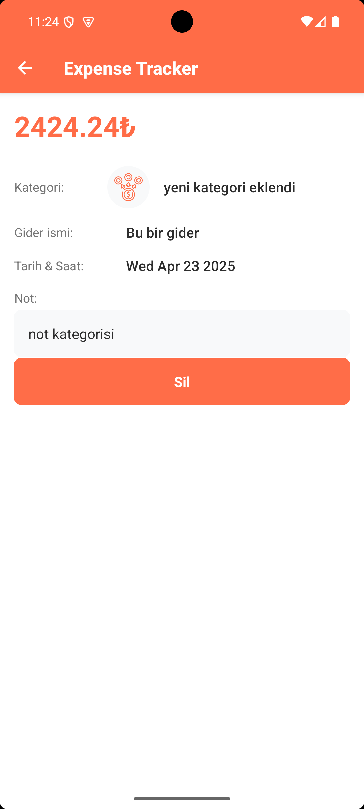
    </td>
    <td align="center">
      <strong>Gider Silindikten Sonra (iOS)</strong><br/>
      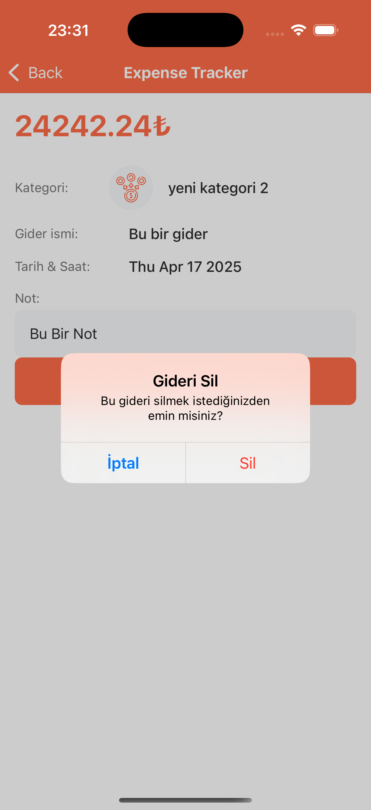
    </td>
  </tr>
  <tr>
    <td align="center">
      <strong>Kategori Listesi (Android)</strong><br/>
      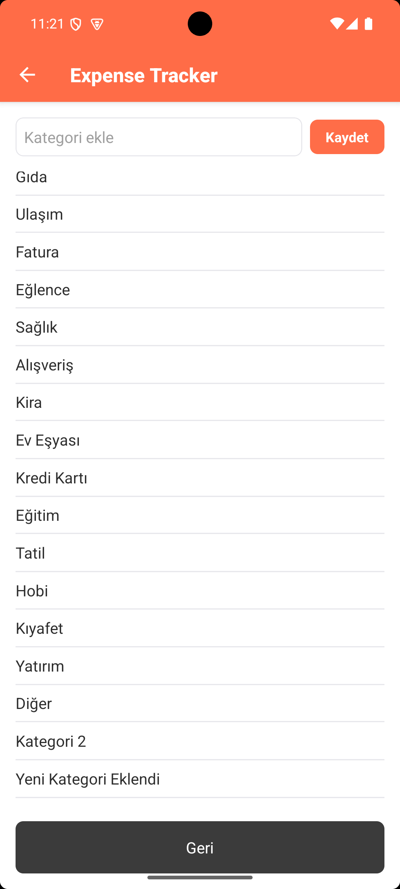
    </td>
    <td align="center">
      <strong>Kategori Listesi (iOS)</strong><br/>
      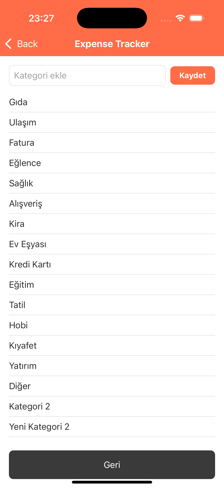
    </td>
  </tr>
</table>

## 🚀 Özellikler

- 📂 Harcamaları kategoriye göre filtreleme
- ➕ Yeni harcama ekleme (isim, tutar, tarih, not, kategori)
- 📊 İstatistik görünümü (gider sayısı, toplam tutar)
- 🗃 Kategori oluşturma ve seçim
- 🧾 Detay ekranında gider bilgisi görüntüleme ve silme

## ⚙️ Kurulum

1. Repoyu klonla:

   ```bash
   git clone https://github.com/kaancaman/ExpenseTracker-RN.git
   cd ExpenseTracker-RN
   ```

2. Bağımlılıkları yükle:

   ```bash
   npm install
   # veya
   yarn
   ```

3. Uygulamayı başlat:
   ```bash
   npx react-native start
   npx react-native run-ios
   npx react-native run-android
   ```

---

## 📁 Proje Yapısı

```bash
.
├── assets/              # Icon, logo vb.
├── components/          # Girişler, butonlar, kartlar
├── data/mock/           # Mock gider ve kategori verileri
├── icon/                # Kategori ikonları (SVG)
├── navigation/          # Stack navigation tanımı
├── screen/              # Ekranlar: Home, AddExpense, Category, Detail
├── theme/               # Tema ayarları (renk, spacing, font)
└── utils/               # UI metinleri, yardımcı fonksiyonlar
```

---

## 🧪 Geliştirici Notları

- Veriler mock olarak tutulur, veritabanı entegrasyonu yapılmamıştır.
- Kategori, harcama ve istatistik yönetimi tamamen lokal state üzerinden yönetilir.
- UI yapısı tema desteklidir (light & dark mode uyumlu).

---

Made with ❤️ by [KAAN CAMAN](https://github.com/KaanCaman)
